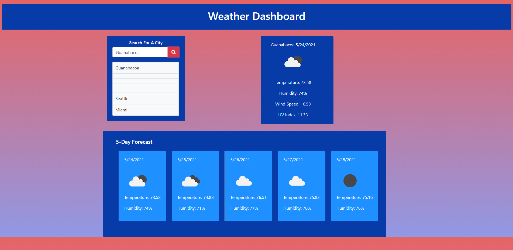

# Weather Dashboard
## by Mike Gordillo
_______________________________________________________________
### Description 
* An App for checking a city's current and five day forecast weather by  city name.
* 
### License : 

* Info on license: https://opensource.org/licenses/MIT
_______________________________________________________________

### Demo:
* Screenshot of deployed site on Github Pages

_______________________________________________________________

_______________________________________________________________

### Installation Instructions:
* Simply clone the repo and run on local machine.

_______________________________________________________________

### Main Language : 
* javascript

### Contribution Policy: 
* suggest improvements
_______________________________________________________________
### Test Cases:
* n/a
_______________________________________________________________
### Contact Me 

* https://github.com/MikeGordillo
* 

### TABLE OF CONTENTS 
_______________________________________________________________
- [Weather Dashboard](#weather-dashboard)
  - [by Mike Gordillo](#by-mike-gordillo)
    - [Description](#description)
    - [License :](#license-)
    - [Demo:](#demo)
    - [Installation Instructions:](#installation-instructions)
    - [Main Language :](#main-language-)
    - [Contribution Policy:](#contribution-policy)
    - [Test Cases:](#test-cases)
    - [Contact Me](#contact-me)
    - [TABLE OF CONTENTS](#table-of-contents)

